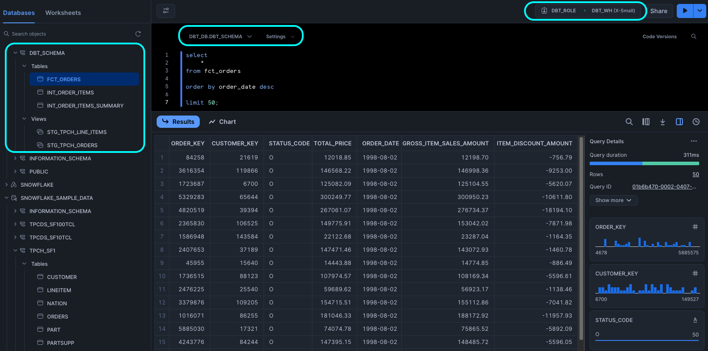
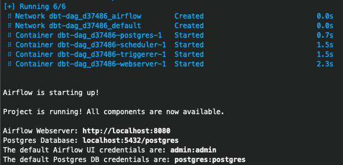
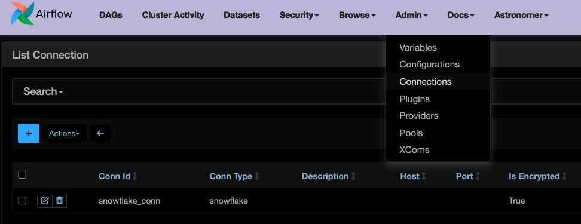
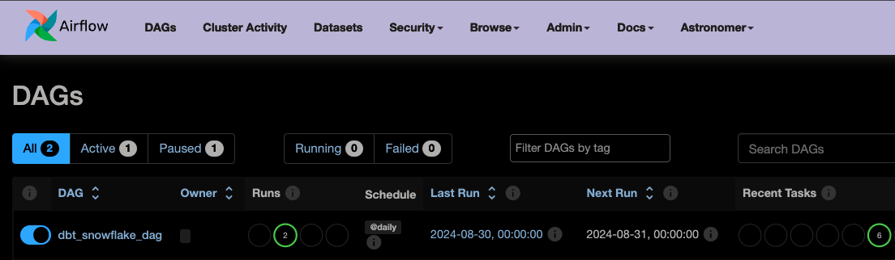
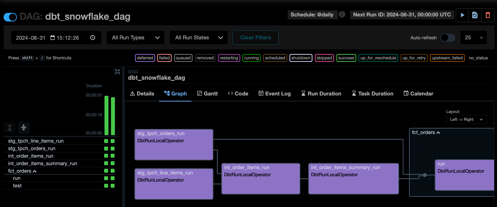

Overview
========

This repo contains a hands-on ELT pipeline building project using Snowflake, dbt Core, and Airflow, with the aim of practicing the orchestration of dbt models using `Cosmos`.

## Introducing Cosmos 

Cosmos is an open-source package from Astronomer that simplifies running dbt Core projects as Airflow DAGs and Task Groups.

* Before Cosmos: Airflow runs your entire dbt project as a single task, making it difficult to investigate and troubleshoot if the task failed halfway through, and it requires a complete rerun from the beginning.
* With Cosmos: Cosmos turns each dbt model into a task group (model task + test task), providing better visibility into the runtime of your dbt project and making it easier to rerun from failure states.


Learning Resources:  

* [Orchestrate your dbt models with Astro, powered by Apache Airflow®](https://www.astronomer.io/integrations/dbt/)
* [astronomer.github.io/astronomer-cosmos](https://astronomer.github.io/astronomer-cosmos/)
* [github.com/astronomer/cosmos-demo](https://github.com/astronomer/cosmos-demo)
* [Astronomer Academy - Astro: Onboarding](https://academy.astronomer.io/your-onboarding-journey)


> *Acknowledgement: This project was created by following a code-along tutorial designed by [@jayzern](https://www.youtube.com/channel/UCF931z8s2EvB67ZIBnLN6gA/search)*

Installation for dbt Modelling
================

## Snowflake Configurations 

```sql
-- use an admin role
use role accountadmin;

-- create the DWH, DB, and role for transformation (dbt project)
create warehouse dbt_wh with warehouse_size='x-small';
create database dbt_db;
create role dbt_role; 

-- grant permissions
grant usage on warehouse dbt_wh to role dbt_role;
grant all on database dbt_db to role dbt_role; 

use role dbt_role;
create schema dbt_db.dbt_schema;


-- create the `dbt` user (will be used to set up dbt `profiles.yml`)
use role accountadmin;
create user if not exists dbt_airflow
  password={password}
  login_name='dbt_airflow'
  must_change_password=FALSE
  default_warehouse='dbt_wh'
  default_role='dbt_role'
  default_namespace='dbt_db.dbt_schema'
  comment='dbt user used for data transformation';
grant role dbt_role to user dbt_airflow;
```

## dbt Setup

1. Create a Python virtual environment using `virtualenv` 

    ```bash
    brew install python@3.11 virtualenv

    virtualenv venv --python=python3.11

    . venv/bin/activate
    ```

2. Install dbt Core with `pip`

    ```bash
    pip install dbt-snowflake==1.7.1
    ```

3. Initialize the `data_pipeline` dbt project by running the `dbt init` command and using your Snowflake account ID and the `dbt` user created in Snowflake UI 

4. `cd` into the `data_pipeline` dbt project and run `dbt debug` to test connections 

5. Build the dbt assets into Snowflake `dev` schema:

    

    > *Skipping the dbt modeling part here as my learning focus is deploying dbt Core with Airflow Cosmos*

Deployment dbt Projects with Airflow (Astro + Cosmos) 
================

1. Install `Astro CLI` and initialize a `dbt-dag` project 

    ```bash
    brew install astro

    mkdir dbt-dag

    cd dbt-dag 

    astro dev init
    ```

    > *Note: I've already installed Docker*

2. Create a virtual environment in `Dockerfile`:

    ```
    RUN python -m venv dbt_venv && source dbt_venv/bin/activate && \
        pip install --no-cache-dir dbt-snowflake && deactivate
    ```

3. Update `requirements.txt` to install `Cosmos`: 

    ```
    astronomer-cosmos
    apache-airflow-providers-snowflake 
    ```

4. Move the `data_pipeline` dbt project into the `dags/dbt/` directory ([docs](https://astronomer.github.io/astronomer-cosmos/getting_started/astro.html#move-your-dbt-project-into-the-dags-directory)) 

5. Create a `.py` DAG file in the root of the DAGs directory

    Useful Docs: 

    * [Create a dagfile](https://astronomer.github.io/astronomer-cosmos/getting_started/astro.html#create-a-dagfile)
    * Profile Mapping - [SnowflakeUserPassword](https://astronomer.github.io/astronomer-cosmos/profiles/SnowflakeUserPassword.html)
    * [Execution Modes](https://astronomer.github.io/astronomer-cosmos/getting_started/execution-modes.html)

6. Start Airflow by running `astro dev start` 

    

7. Access Airflow UI to trigger the DAG

* Add `snowflake_conn` connection under `Admin` -> `Connections`

    

* Turn on and trigger the DAG

    


    